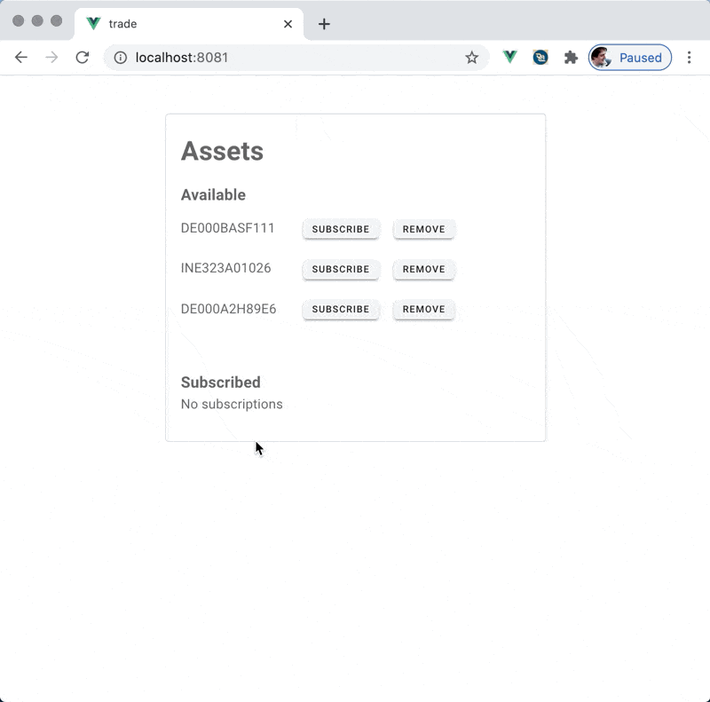
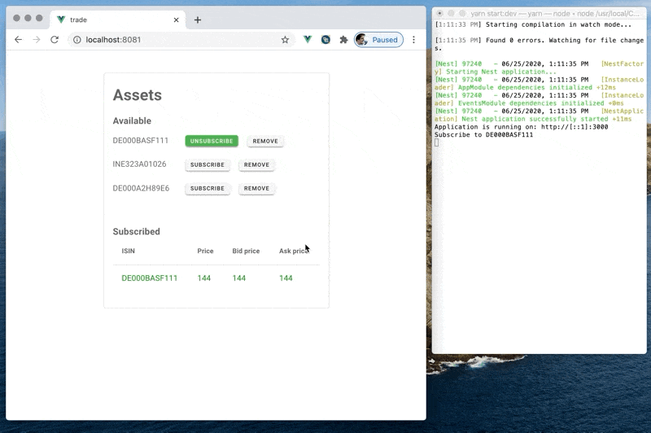

# Trade

Vue app to show real-time price data from Websocket. Frontend part of [Trade-ws](https://github.com/aledoroshenko/trade-ws). Subscribe and unsubscribe to asset prices feed, which comes through socket.



In case of connection failure try app will try to reestablish connection, and it was successful - resubscribe to existed prices feed.



### Subscribe (with native Websockets)

```javascript
this.websocket.send(
  JSON.stringify({
    event: "events",
    data: { type: "subscribe", subscribe: isin }
  })
);
```

### Unsubscribe

```javascript
this.websocket.send(
  JSON.stringify({
    event: "events",
    data: { type: "unsubscribe", unsubscribe: isin }
  })
);
```

## Project setup

```
yarn install
yarn serve
```
